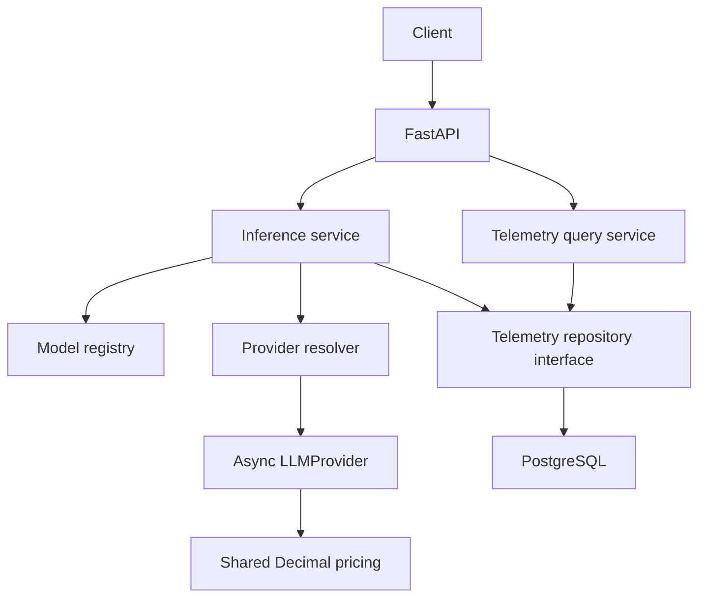

# Adaptive LLM Gateway

LLM applications often use the same expensive model for every request even when
cheaper models may be sufficient. The long-term goal is an adaptive inference
gateway that selects the lowest-cost model predicted to satisfy a configurable
quality requirement.

**Current status: Phase 3 — PostgreSQL inference telemetry.** Phase 1 domain models,
pricing, registry, and deterministic providers remain in place. Phase 2 exposes
explicit model selection through FastAPI. Phase 3 adds metadata-only telemetry,
Alembic migrations, and a metrics summary. Intelligent routing is not implemented.

## Install and run

Python 3.12+ is required. From the repository root:

```sh
python3.12 -m venv .venv
source .venv/bin/activate
python -m pip install -e '.[dev]'
python -m pytest -m 'not postgres'
```

Alternatively use `uv venv --python 3.12` and `uv pip install -e '.[dev]'`.

```sh
python -m uvicorn adaptive_llm_gateway.api.app:app --reload --host 127.0.0.1 --port 8000
```

API documentation: <http://127.0.0.1:8000/docs>. OpenAPI:
<http://127.0.0.1:8000/openapi.json>. Importing the app opens no database connection
and starts no server. The ASGI lifespan creates/disposes database resources.

Without `DATABASE_URL`, offline inference remains available, startup logs
`telemetry_disabled`, and metrics returns 503. There is no silent in-memory
persistence fallback. To enable telemetry, configure and migrate PostgreSQL below.
The two fake models require no paid APIs or provider credentials.

## PostgreSQL setup and migrations

PostgreSQL runs in Docker; FastAPI and Python run locally on macOS. No native
PostgreSQL installation is needed. Start Docker Desktop, then from this directory:

```sh
cp .env.example .env  # first setup only; keep an existing configured .env
source .venv/bin/activate
set -a
source .env
set +a
docker compose up -d
docker compose up -d --wait --wait-timeout 120
python -m alembic upgrade head
python -m alembic current
python -m uvicorn adaptive_llm_gateway.api.app:app --reload
```

The second Compose command waits for a healthy database; do not migrate before
that succeeds. `docker compose ps` shows health. The image is pinned to
`postgres:18.6`, a supported PostgreSQL 18 release. It exposes only
`127.0.0.1:5432`. Ensure that host port is free before startup.

Compose initializes two databases with separate non-superuser owner roles:

| Purpose | Database / role | Local-only password |
| --- | --- | --- |
| Development | `routellm` | `local_dev_only` |
| Integration tests | `routellm_test` | `local_test_only` |

The bootstrap admin uses `local_admin_only`; application/test URLs never use that
superuser. These are public development placeholders, not private credentials or
production settings. `.env.example` supplies both localhost asyncpg URLs. `.env`
is ignored by Git, and the application reads exported variables rather than
loading the file itself. No private credentials or database files belong in Git.

The init SQL revokes public database access: the test role cannot connect to the
development database, and the development role cannot connect to the test one.
Tests additionally reject any URL whose database or role is not `routellm_test`,
and each test migrates/cleans up only its own randomly named schema.

Data lives in the Docker named volume `routellm_postgres_data`, mounted at
`/var/lib/postgresql` for PostgreSQL 18. Initialization SQL runs only on the first
start of an empty volume. Editing init SQL or credentials does not alter an
existing initialized volume. Stop the container while preserving its data with:

```sh
docker compose down
```

Do not add `--volumes` unless deliberately deleting all local development/test
data. The API is not containerized.

`upgrade head` creates the schema in an existing database or applies pending
migrations. It does not create the database itself. Revision `0001` creates
`inference_telemetry`. Runtime never calls `create_all()` or applies migrations.
To develop later schema changes, generate and review a migration before applying:

```sh
python -m alembic revision --autogenerate -m 'describe schema change'
python -m alembic upgrade head
python -m alembic check
```

To inspect PostgreSQL DDL without connecting (a valid `DATABASE_URL` is still
required): `python -m alembic upgrade head --sql`. Do not downgrade a populated
schema casually: revision `0001` downgrade drops the telemetry table.

Missing configuration disables telemetry explicitly; malformed configuration
fails startup with a credential-redacted validation error. A configured but
unreachable/unmigrated database logs a startup probe warning and lets inference
serve. Each write still attempts persistence, allowing recovery after migration
or reconnection. `/health` remains process liveness, not database readiness.

## API examples

```sh
curl http://127.0.0.1:8000/health
curl http://127.0.0.1:8000/v1/models
curl -i http://127.0.0.1:8000/v1/inference \
  -H 'Content-Type: application/json' \
  -H 'X-Request-ID: demo-001' \
  -d '{"model_id":"fake-small","prompt":"Hello adaptive gateway","max_output_tokens":2,"temperature":1}'
curl http://127.0.0.1:8000/v1/metrics/summary
```

The inference response is HTTP 200 with `X-Request-ID: demo-001`:

```json
{
  "text": "Hello adaptive",
  "model_id": "fake-small",
  "provider": "fake",
  "input_tokens": 3,
  "output_tokens": 2,
  "latency_ms": 0.0,
  "estimated_cost_usd": "0.00000165",
  "request_id": "demo-001"
}
```

With an initially empty database, the subsequent metrics response is:

```json
{
  "total_requests": 1,
  "successful_requests": 1,
  "failed_requests": 0,
  "total_estimated_cost_usd": "0.00000165",
  "average_latency_ms": 0.0,
  "total_input_tokens": 3,
  "total_output_tokens": 2
}
```

Decimal values serialize as strings (including possible scientific notation).
An empty available database returns zero counts/totals and null average latency.
Unavailable or unconfigured storage returns 503 `telemetry_unavailable`, never
fabricated zero totals. Metrics describe persisted records, not necessarily every
HTTP request. Aggregates cover all history; per-model breakdowns are deferred.

| Endpoint | Behavior |
| --- | --- |
| `GET /health` | `{"status":"ok"}` |
| `GET /v1/models` | Enabled models with registered adapters |
| `POST /v1/inference` | Async generation using explicit `model_id` |
| `GET /v1/metrics/summary` | Aggregate persisted telemetry |

Discovery intentionally exposes only model ID, provider, and context window.
Provider model names and pricing stay out of discovery; cost is returned per
inference. Both development models use `FakeProvider` and synthetic prices:

| Model | Input USD / 1M tokens | Output USD / 1M tokens | Context window |
| --- | --- | --- | --- |
| `fake-small` | 0.15 | 0.60 | 4096 |
| `fake-large` | 1.00 | 3.00 | 16384 |

The fake adapter counts whitespace-separated words, includes system text in input
usage, echoes up to `max_output_tokens` prompt words, and reports zero simulated
latency. Temperature has no effect. This is a test convention, not a real tokenizer
or HTTP round-trip measurement. Disabled models and context overflow are rejected.

## Architecture

```text
src/adaptive_llm_gateway/
  models/       Immutable provider-independent Pydantic schemas
  pricing/      Exact Decimal cost calculation
  registry/     In-memory model catalog
  providers/    Async contract, FakeProvider, provider factory resolver
  application/  Inference orchestration and best-effort telemetry lifecycle
  telemetry/    Storage-independent event/repository contracts and query service
  persistence/  Environment settings, async engine, ORM model, PostgreSQL repository
  api/          HTTP schemas, dependency injection, routes, error translation
  bootstrap.py  Two fake development models
  runtime.py    Application resource composition and async lifecycle
migrations/     Alembic environment, template, and schema revisions
```



Domain/provider layers have no HTTP or SQLAlchemy dependencies. The application
service uses a repository protocol; the API knows no ORM models. The PostgreSQL
adapter uses SQLAlchemy 2.0 async sessions and asyncpg. Provider factories receive
the selected `ModelConfig` and must be cheap/nonblocking. No routing or fallback
occurs. `create_app(service=...)` and `get_service` dependency overrides permit
isolated tests with a fake repository and no PostgreSQL.

Model configurations are immutable. Token counts are nonnegative integers, prices
are finite nonnegative Decimals, and request validation is reused by the HTTP
schema. The registry preserves insertion order and rejects duplicate IDs.
Cost is `(input_tokens * input_rate + output_tokens * output_rate) / 1_000_000`.
Pricing reserves sufficient Decimal precision without rounding; persistence copies
the result without recalculation.

## Telemetry schema and lifecycle

`inference_telemetry` stores:

- UUID primary key; nonunique indexed request ID; model/provider snapshots.
- Nullable BIGINT token counts; double-precision latency in milliseconds.
- Unconstrained PostgreSQL NUMERIC estimated USD cost (Decimal, no float currency).
- Success boolean, normalized nullable error category, timezone-aware timestamp.
- Requested output budget, temperature, prompt/system-prompt character lengths.

There are indexes on request ID, creation time, and `(model_id, created_at)`, plus
nonnegative usage/cost and outcome consistency checks. Model snapshots have no
foreign key to the in-memory registry. Repeated correlation IDs create separate
records with different database IDs; they are not idempotency keys.

For success, the service copies provider-reported usage, latency, and cost. For a
known model's disabled/context/unavailable-adapter/provider failure, it records a
normalized category and elapsed attempt time, excluding telemetry write time.
Failed usage/cost stays null because the provider did not supply reliable values.
No guessed charge or duplicated price calculation is used. Timestamps are UTC
application completion timestamps, assigned before the write.

Malformed requests, invalid correlation headers, and unknown model IDs are not
inference records. Cancellation propagates and is not recorded as provider failure;
a cancelled request may have no record. Raw prompts, system prompts, responses,
provider exception messages, stack traces, and credentials are never stored.

Each write uses a fresh session/transaction: commit on success, rollback on failure,
and close on exit. Queries use their own closed-after-read session. Sessions are
never shared across requests. The engine pool belongs to app lifespan and is
explicitly disposed at shutdown. Schema changes belong solely to Alembic.

The summary averages latency across all recorded successes and failures, excludes
unknown usage/cost from sums, and counts both outcomes. Because failed charges are
unknown, the cost total is the sum of known estimates, not an invoice. Fake success
latency is zero; failed attempt latency is measured by the service.

## Telemetry failure semantics and logging

If inference succeeds but persistence fails, return the original successful
response. If inference fails and its telemetry write fails too, preserve the
original inference error. Emit `telemetry_write_failed` with the request ID;
never log driver exception text or tracebacks, which could include sensitive data.

Writes and metrics queries have a configurable deadline (default 2 seconds, range
0–30 exclusive of zero), plus driver connection/command timeouts. Timeouts cancel
the operation and unwind its session context. This adds up to the deadline plus
resource cleanup to request latency. Events can be lost or have an ambiguous
commit outcome on connection loss; no retry, queue, or durability guarantee is
added. This is deliberate best-effort, availability-oriented telemetry. Startup
probe and query failures are also logged without sensitive exception details.

## HTTP errors and correlation

Errors keep a consistent envelope:

```json
{
  "error": {"code": "model_not_found", "message": "The requested model was not found."},
  "request_id": "demo-001"
}
```

| Status | Code |
| --- | --- |
| 400 | `invalid_request_id` |
| 403 | `model_disabled` |
| 404 | `model_not_found` |
| 422 | `invalid_request` or `context_limit_exceeded` |
| 502 | `provider_failure` |
| 503 | `provider_unavailable` or `telemetry_unavailable` |
| 500 | `internal_error` |

The middleware generates UUID4 IDs or accepts one `X-Request-ID` header containing
1–128 ASCII letters, digits, dots, underscores, or hyphens, beginning with a letter
or digit. IDs appear in headers and inference/error bodies and are accessible at
`request.state.request_id`. They are correlation labels, not authentication.

## Tests and verification

```sh
python -m pytest                         # all tests; PostgreSQL tests skip without URL
python -m pytest -m 'not postgres'       # normal unit/API suite, no database required
```

The original 101 tests are preserved. New tests cover event metadata/privacy,
success/failure persistence, failure availability semantics, write timeout cleanup,
query aggregates, metrics, configuration redaction, startup/disposal, repository
transaction boundaries, and offline Alembic PostgreSQL DDL generation.

Real persistence tests use the dedicated Docker `routellm_test` database and
role from `.env.example`. They run migrations into a random schema per test and
drop only that schema afterward. They never substitute SQLite.

```sh
source .venv/bin/activate
set -a
source .env
set +a
docker compose up -d --wait --wait-timeout 120
python -m pytest -m postgres -v  # all three real PostgreSQL tests
python -m pytest                # complete suite, including PostgreSQL
```

Integration tests verify committed rows, exact Decimal/timestamp round-trips,
aggregate SQL, constraint/duplicate rollback and session recovery, schema drift,
and downgrade/upgrade. Database errors fail tests when a URL is configured;
they skip only when `TEST_DATABASE_URL` is absent. Normal unit tests clear
`DATABASE_URL` so they never write to the development database.

Docker validation: **3 PostgreSQL integration tests passed**; the complete suite
finished with **142 passed, no skips**. The development
migration reached **0001 (head)**. Two preexisting upstream Starlette/httpx and
AnyIO deprecation warnings remain; they do not affect test outcomes.

## Deliberately deferred

Intelligent routing, ML, real provider APIs, Redis, Celery/background workers,
caching, retries/fallback/escalation, evaluation pipelines, per-model analytics,
frontend, Prometheus/Grafana, API containerization, Kubernetes, and CI/CD remain future work.
Docker Compose is used only for local PostgreSQL infrastructure.
