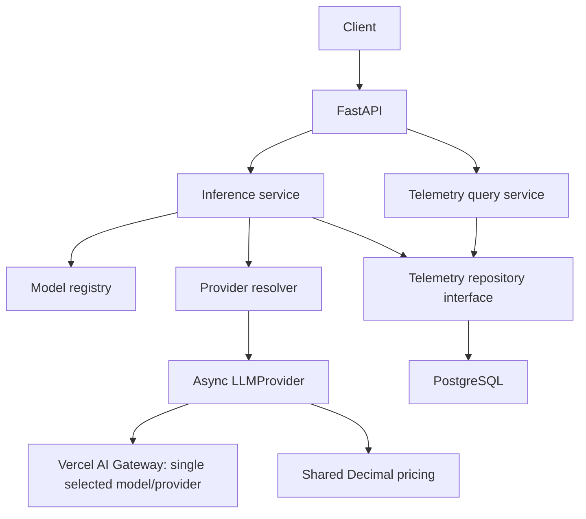

# Adaptive LLM Gateway

LLM applications often use the same expensive model for every request even when
cheaper models may be sufficient. The long-term goal is an adaptive inference
gateway that selects the lowest-cost model predicted to satisfy a configurable
quality requirement.

**Current status: Phase 8D composes the versioned quality predictor and cost-aware
policy behind an offline-only routing service. It remains intentionally disconnected
from public inference and provider execution.**
RouteLLM owns model definitions, explicit model selection, Decimal cost estimates,
and PostgreSQL production telemetry. Vercel AI Gateway provides model access only.
A separate controlled benchmark runner produces experimental artifacts, and an
offline evaluator derives versioned quality measurements from stored responses.
Automated inference routing and escalation are not integrated.

## Install and run

Python 3.12+ is required. From the repository root:

```sh
python3.12 -m venv .venv
source .venv/bin/activate
python -m pip install -e '.[dev]'
python -m pytest -m 'not postgres and not real_provider'
```

Alternatively use `uv venv --python 3.12` and `uv pip install -e '.[dev]'`.

```sh
python -m uvicorn adaptive_llm_gateway.api.app:app --reload --host 127.0.0.1 --port 8000
```

API documentation: <http://127.0.0.1:8000/docs>. OpenAPI:
<http://127.0.0.1:8000/openapi.json>. Importing the app opens no database connection
and starts no server. The ASGI lifespan creates/disposes database resources.

Without `DATABASE_URL`, offline inference remains available, startup logs
`telemetry_disabled`, and metrics returns 503. There is no silent in-memory
persistence fallback. To enable telemetry, configure and migrate PostgreSQL below.
The two fake models require no paid APIs or provider credentials.

## PostgreSQL setup and migrations

PostgreSQL runs in Docker; FastAPI and Python run locally on macOS. No native
PostgreSQL installation is needed. Start Docker Desktop, then from this directory:

```sh
cp .env.example .env  # first setup only; keep an existing configured .env
source .venv/bin/activate
set -a
source .env
set +a
docker compose up -d
docker compose up -d --wait --wait-timeout 120
python -m alembic upgrade head
python -m alembic current
python -m uvicorn adaptive_llm_gateway.api.app:app --reload
```

The second Compose command waits for a healthy database; do not migrate before
that succeeds. `docker compose ps` shows health. The image is pinned to
`postgres:18.6`, a supported PostgreSQL 18 release. It exposes only
`127.0.0.1:5432`. Ensure that host port is free before startup.

Compose initializes two databases with separate non-superuser owner roles:

| Purpose | Database / role | Local-only password |
| --- | --- | --- |
| Development | `routellm` | `local_dev_only` |
| Integration tests | `routellm_test` | `local_test_only` |

The bootstrap admin uses `local_admin_only`; application/test URLs never use that
superuser. These are public development placeholders, not private credentials or
production settings. `.env.example` supplies both localhost asyncpg URLs. `.env`
is ignored by Git, and the application reads exported variables rather than
loading the file itself. No private credentials or database files belong in Git.

The init SQL revokes public database access: the test role cannot connect to the
development database, and the development role cannot connect to the test one.
Tests additionally reject any URL whose database or role is not `routellm_test`,
and each test migrates/cleans up only its own randomly named schema.

Data lives in the Docker named volume `routellm_postgres_data`, mounted at
`/var/lib/postgresql` for PostgreSQL 18. Initialization SQL runs only on the first
start of an empty volume. Editing init SQL or credentials does not alter an
existing initialized volume. Stop the container while preserving its data with:

```sh
docker compose down
```

Do not add `--volumes` unless deliberately deleting all local development/test
data. The API is not containerized.

`upgrade head` creates the schema in an existing database or applies pending
migrations. It does not create the database itself. Revision `0001` creates
`inference_telemetry`. Runtime never calls `create_all()` or applies migrations.
To develop later schema changes, generate and review a migration before applying:

```sh
python -m alembic revision --autogenerate -m 'describe schema change'
python -m alembic upgrade head
python -m alembic check
```

To inspect PostgreSQL DDL without connecting (a valid `DATABASE_URL` is still
required): `python -m alembic upgrade head --sql`. Do not downgrade a populated
schema casually: revision `0001` downgrade drops the telemetry table.

Missing configuration disables telemetry explicitly; malformed configuration
fails startup with a credential-redacted validation error. A configured but
unreachable/unmigrated database logs a startup probe warning and lets inference
serve. Each write still attempts persistence, allowing recovery after migration
or reconnection. `/health` remains process liveness, not database readiness.

## API examples

```sh
curl http://127.0.0.1:8000/health
curl http://127.0.0.1:8000/v1/models
curl -i http://127.0.0.1:8000/v1/inference \
  -H 'Content-Type: application/json' \
  -H 'X-Request-ID: demo-001' \
  -d '{"model_id":"fake-small","prompt":"Hello adaptive gateway","max_output_tokens":2,"temperature":1}'
curl http://127.0.0.1:8000/v1/metrics/summary
```

The inference response is HTTP 200 with `X-Request-ID: demo-001`:

```json
{
  "text": "Hello adaptive",
  "model_id": "fake-small",
  "provider": "fake",
  "input_tokens": 3,
  "output_tokens": 2,
  "latency_ms": 0.0,
  "estimated_cost_usd": "0.00000165",
  "request_id": "demo-001"
}
```

With an initially empty database, the subsequent metrics response is:

```json
{
  "total_requests": 1,
  "successful_requests": 1,
  "failed_requests": 0,
  "total_estimated_cost_usd": "0.00000165",
  "average_latency_ms": 0.0,
  "total_input_tokens": 3,
  "total_output_tokens": 2
}
```

Decimal values serialize as strings (including possible scientific notation).
An empty available database returns zero counts/totals and null average latency.
Unavailable or unconfigured storage returns 503 `telemetry_unavailable`, never
fabricated zero totals. Metrics describe persisted records, not necessarily every
HTTP request. Aggregates cover all history; per-model breakdowns are deferred.

| Endpoint | Behavior |
| --- | --- |
| `GET /health` | `{"status":"ok"}` |
| `GET /v1/models` | Enabled models with registered adapters |
| `POST /v1/inference` | Async generation using explicit `model_id` |
| `GET /v1/metrics/summary` | Aggregate persisted telemetry |
| `GET /v1/benchmarks/{run_id}/summary` | Read a previously generated evaluation summary |

Discovery intentionally exposes only model ID, provider, and context window.
Provider model names and pricing stay out of discovery; cost is returned per
inference. Both development models use `FakeProvider` and synthetic prices:

| Model | Input USD / 1M tokens | Output USD / 1M tokens | Context window |
| --- | --- | --- | --- |
| `fake-small` | 0.15 | 0.60 | 4096 |
| `fake-large` | 1.00 | 3.00 | 16384 |

The fake adapter counts whitespace-separated words, includes system text in input
usage, echoes up to `max_output_tokens` prompt words, and reports zero simulated
latency. Temperature has no effect. This is a test convention, not a real tokenizer
or HTTP round-trip measurement. Disabled models and context overflow are rejected.

## Architecture

```text
src/adaptive_llm_gateway/
  models/       Immutable provider-independent Pydantic schemas
  pricing/      Exact Decimal cost calculation
  registry/     In-memory model catalog
  providers/    Async contract, fake/Vercel adapters, reviewed real-model portfolio
  benchmarks/   Dataset schemas, sequential runner, atomic file repository, CLI
                plus request-derived feature extraction and V2 validation
  evaluation/   Deterministic category evaluators, aggregation, file repository, CLI
  routing/      Offline experiments plus provider-independent policy boundaries
  application/  Inference orchestration and best-effort telemetry lifecycle
  telemetry/    Storage-independent event/repository contracts and query service
  persistence/  Environment settings, async engine, ORM model, PostgreSQL repository
  api/          HTTP schemas, dependency injection, routes, error translation
  bootstrap.py  Fake defaults and optional credential-enabled real models
  runtime.py    Application resource composition and async lifecycle
migrations/     Alembic environment, template, and schema revisions
```



Domain models have no HTTP or SQLAlchemy dependencies. The Vercel adapter alone
translates external HTTP requests and responses. The application
service uses a repository protocol; the API knows no ORM models. The PostgreSQL
adapter uses SQLAlchemy 2.0 async sessions and asyncpg. Provider factories receive
the selected `ModelConfig` and must be cheap/nonblocking. No routing or fallback
occurs. `create_app(service=...)` and `get_service` dependency overrides permit
isolated tests with a fake repository and no PostgreSQL.

Model configurations are immutable. Token counts are nonnegative integers, prices
are finite nonnegative Decimals, and request validation is reused by the HTTP
schema. The registry preserves insertion order and rejects duplicate IDs.
Cost is `(input_tokens * input_rate + output_tokens * output_rate) / 1_000_000`.
Pricing reserves sufficient Decimal precision without rounding; persistence copies
the result without recalculation.

The production routing boundary and its separation from offline experiments are
documented in [`docs/routing-policy.md`](docs/routing-policy.md). It is not yet
connected to `/v1/inference`.

## Telemetry schema and lifecycle

`inference_telemetry` stores:

- UUID primary key; nonunique indexed request ID; model/provider snapshots.
- Nullable BIGINT token counts; double-precision latency in milliseconds.
- Unconstrained PostgreSQL NUMERIC estimated USD cost (Decimal, no float currency).
- Success boolean, normalized nullable error category, timezone-aware timestamp.
- Requested output budget, temperature, prompt/system-prompt character lengths.

There are indexes on request ID, creation time, and `(model_id, created_at)`, plus
nonnegative usage/cost and outcome consistency checks. Model snapshots have no
foreign key to the in-memory registry. Repeated correlation IDs create separate
records with different database IDs; they are not idempotency keys.

For success, the service copies provider-reported usage, latency, and cost. For a
known model's disabled/context/unavailable-adapter/provider failure, it records a
normalized category and elapsed attempt time, excluding telemetry write time.
Failed usage/cost stays null because the provider did not supply reliable values.
No guessed charge or duplicated price calculation is used. Timestamps are UTC
application completion timestamps, assigned before the write.

Malformed requests, invalid correlation headers, and unknown model IDs are not
inference records. Cancellation propagates and is not recorded as provider failure;
a cancelled request may have no record. Raw prompts, system prompts, responses,
provider exception messages, stack traces, and credentials are never stored.

Each write uses a fresh session/transaction: commit on success, rollback on failure,
and close on exit. Queries use their own closed-after-read session. Sessions are
never shared across requests. The engine pool belongs to app lifespan and is
explicitly disposed at shutdown. Schema changes belong solely to Alembic.

The summary averages latency across all recorded successes and failures, excludes
unknown usage/cost from sums, and counts both outcomes. Because failed charges are
unknown, the cost total is the sum of known estimates, not an invoice. Fake success
latency is zero; failed attempt latency is measured by the service.

## Telemetry failure semantics and logging

If inference succeeds but persistence fails, return the original successful
response. If inference fails and its telemetry write fails too, preserve the
original inference error. Emit `telemetry_write_failed` with the request ID;
never log driver exception text or tracebacks, which could include sensitive data.

Writes and metrics queries have a configurable deadline (default 2 seconds, range
0–30 exclusive of zero), plus driver connection/command timeouts. Timeouts cancel
the operation and unwind its session context. This adds up to the deadline plus
resource cleanup to request latency. Events can be lost or have an ambiguous
commit outcome on connection loss; no retry, queue, or durability guarantee is
added. This is deliberate best-effort, availability-oriented telemetry. Startup
probe and query failures are also logged without sensitive exception details.

## HTTP errors and correlation

Errors keep a consistent envelope:

```json
{
  "error": {"code": "model_not_found", "message": "The requested model was not found."},
  "request_id": "demo-001"
}
```

| Status | Code |
| --- | --- |
| 400 | `invalid_request_id` |
| 403 | `model_disabled` |
| 404 | `model_not_found` |
| 422 | `invalid_request` or `context_limit_exceeded` |
| 502 | `provider_failure` |
| 503 | `provider_unavailable` or `telemetry_unavailable` |
| 500 | `internal_error` |

The middleware generates UUID4 IDs or accepts one `X-Request-ID` header containing
1–128 ASCII letters, digits, dots, underscores, or hyphens, beginning with a letter
or digit. IDs appear in headers and inference/error bodies and are accessible at
`request.state.request_id`. They are correlation labels, not authentication.

## Vercel AI Gateway integration

The adapter uses the documented [Chat Completions REST API](https://vercel.com/docs/ai-gateway/sdks-and-apis/openai-chat-completions/chat-completions):
`POST https://ai-gateway.vercel.sh/v1/chat/completions`, bearer authentication,
`provider/model-name` identifiers, system/user messages, `max_tokens`, temperature,
and `stream: false`. It reads text from `choices[0].message.content` and actual
usage from `usage.prompt_tokens` / `usage.completion_tokens`.

Each request restricts `providerOptions.gateway.only` to exactly one upstream
(`openai` or `anthropic`). No fallback models, provider preference chains, sorting,
or intelligent routing are requested. See Vercel's
[provider controls](https://vercel.com/docs/ai-gateway/models-and-providers/provider-options).
HTTPX performs one call with no retries, no redirects, and no environment proxy
inheritance. API credentials and raw upstream errors never enter domain objects,
HTTP error bodies, telemetry, or benchmark artifacts.

Add your key only to the ignored local `.env`:

```sh
# Edit .env locally (do not paste the actual key into version-controlled files):
# AI_GATEWAY_API_KEY=your_private_key
# AI_GATEWAY_TIMEOUT_SECONDS=60
set -a
source .env
set +a
python -m uvicorn adaptive_llm_gateway.api.app:app --reload
```

Restart the local API after changing exported configuration. Real models are
registered at application startup only when a nonempty key is configured. Without
it, discovery contains only the two fake models; an unregistered real ID returns
404. Direct adapter use without a key fails locally with `gateway_not_configured`.
No models or prices are fetched automatically at startup.

### Reviewed model portfolio

Verified **2026-09-23** against Vercel's public
[model catalog](https://ai-gateway.vercel.sh/v1/models). Configuration is centralized
in `providers/gateway_config.py`; prices are Decimal USD per one million tokens.

| Internal ID | External gateway ID | Input / 1M | Output / 1M | Context | Role |
| --- | --- | --- | --- | --- | --- |
| `gateway-nano` | `openai/gpt-4.1-nano` | $0.10 | $0.40 | 1,047,576 | Inexpensive baseline for short, simple tasks |
| `gateway-mini` | `openai/gpt-4.1-mini` | $0.40 | $1.60 | 1,047,576 | Middle cost/capability tier |
| `gateway-sonnet` | `anthropic/claude-sonnet-4.6` | $3.00 | $15.00 | 1,000,000 | Stronger coding/reasoning candidate |

These are available catalog models with documented text support and meaningful
cost diversity, not a claim of measured benchmark quality. The nano/mini pair
helps compare inexpensive models within one family; Sonnet adds a stronger,
different-family candidate. Upstream access remains subject to account availability.
The normalized provider is `vercel`; the external vendor/model stays in registry
configuration and benchmark snapshots. Callers select internal IDs.

Prices are time-sensitive standard uncached rates. Costs are estimates calculated
by RouteLLM's existing pricing function; caching, service tiers, region pricing,
and other billing adjustments are not modeled. Gateway-reported costs are not
substituted. Review the source before larger experiments; no fabricated fallback
price is used. Missing authoritative usage is an explicit `gateway_missing_usage`
failure, potentially after a charge; failed calls retain unknown cost as null.

```sh
curl http://127.0.0.1:8000/v1/models
# This real call may incur a charge:
curl http://127.0.0.1:8000/v1/inference \
  -H 'Content-Type: application/json' \
  -d '{"model_id":"gateway-nano","prompt":"Explain binary search in one sentence.","max_output_tokens":48,"temperature":0}'
```

Provider-call latency uses a monotonic timer from client setup through complete
HTTP response receipt, excluding telemetry. Explicit HTTP timeouts and an outer
wall-clock deadline use `AI_GATEWAY_TIMEOUT_SECONDS` (default 60, >0 and <=300).
Provider-specific parameter limits are validated by the gateway rather than
silently clamped, and context errors use allowlisted upstream machine codes.

Normalized errors distinguish authentication, invalid model/request, rate limit,
timeout, upstream failure, malformed response, and missing usage. Gateway rate
limits map to HTTP 429, timeouts to 504, invalid requests/context to 422, missing
configuration to 503, and other upstream errors to 502. Authentication failure
is upstream failure, not a client authentication challenge. Only safe categories
are stored by the existing production telemetry pipeline; no raw error bodies.

## Controlled benchmarks

The version-controlled `benchmarks/datasets/foundation-v1.json` contains **35
original tasks: five each for QA, summarization, extraction, classification,
structured JSON, reasoning, and coding**. Each task has a stable ID, prompt,
system prompt, output budget, temperature, output type, reference metadata,
and tags. Version 1.1.0 adds category-specific ground truth and an explicit
acceptable threshold for every task. The controlled inputs contain no credentials
or private data.

The runner sends the same tasks and generation settings to every explicitly
selected model, sequentially in task-then-model order. There is no concurrency,
retry, model substitution, or inline quality evaluation. Defaults are one task and
`fake-small`. A storage-independent repository protocol stores experiments as:

```text
benchmark-results/<run-uuid>/
  manifest.json       UTC time, full dataset snapshot/hash/version, selected tasks,
                      model IDs/pricing/context snapshots, execution configuration
  results/<uuid>.json one outcome per task/model: text, usage, latency, Decimal cost,
                      correlation ID, timestamp, or normalized failure category
  status.json         running, completed, or aborted, with completion time
  evaluations/<result-uuid>.json
                      versioned score/pass record derived from one stored response
  evaluation-summary.json
                      overall, per-model, per-model/category, and pairwise metrics
```

Files are JSON with string Decimal costs. Results are flushed and atomically
published after each call. The manifest is persisted before any calls. Storage
failure stops further work; call failures are recorded and remaining pairs proceed.
`completed` means all pairs were attempted, not that every call succeeded. On
process crash a run may remain `running`; resume/deduplication and distributed
tracking are deferred. Keep the artifacts if you want to evaluate the responses
later. The ignored output directory is local experimental data, not a database
backup or a production telemetry table. There is no new PostgreSQL migration.

A separate inference-service instance shares registry/resolver configuration but
has **no production telemetry repository**, so benchmark prompts/responses and
costs cannot contaminate ordinary telemetry through the runner. File storage
retains only controlled dataset inputs and generated results, never API settings
or keys. Use only controlled project datasets with this CLI.

Dataset version, SHA-256, exact task/model snapshots, ordering, and generation
parameters support comparison, but temperature zero does not guarantee identical
outputs from hosted models, and upstream aliases can change over time.

```sh
# Offline example: two tasks x two fake models, no network or credentials:
python -m adaptive_llm_gateway.benchmarks --models fake-small fake-large --limit 2

# Optional paid example: exactly one task on one inexpensive model:
python -m adaptive_llm_gateway.benchmarks --models gateway-nano --limit 1 --allow-paid
```

Custom paths: `--dataset PATH --output PATH`. Duplicate model IDs, invalid task
IDs, empty datasets, and nonpositive limits are rejected. A real model requires
both credentials and the explicit `--allow-paid` flag. Do not launch a full paid
benchmark without reviewing call count and output budgets.

## Offline quality evaluation

Evaluation is deterministic first: it uses controlled ground truth and never calls
an LLM judge or provider. A `BenchmarkTask` and stored `BenchmarkResult` are passed
to a category evaluator, producing an immutable `EvaluationResult`. Each result
records evaluator name/version, a quality score from 0 through 1, the task threshold,
the derived acceptable flag, a plain-language reason, and component scores. A failed
model call receives score 0 and is unacceptable because there is no response to grade.

`acceptable` means exactly `quality_score >= acceptable_threshold`. QA,
classification, extraction, JSON, reasoning, and coding currently require 1.0.
Summarization uses 0.8 because its transparent proxy rubric allows partial fact
coverage. Thresholds live in the versioned dataset rather than one global setting.

| Category | Evaluator and score semantics |
| --- | --- |
| Factual QA | Conservative normalized exact match against explicitly accepted answers |
| Classification | Conservative normalized exact match against the expected label |
| Extraction | Field/value precision-recall F1 over parsed JSON; extra fields reduce precision |
| Structured JSON | Equal average of valid syntax, required typed structure F1, and expected-value recall |
| Reasoning | Exact match on the final answer only; chain of thought is neither required nor stored |
| Coding | V1 retains static structure scoring; V2 uses hidden functional fixtures in an opt-in Docker sandbox after static validation |
| Summarization | V1 retains its deterministic proxy; V2 combines deterministic format checks with an explicitly supplied semantic judge |

Normalization trims surrounding whitespace, collapses whitespace, folds case where
the evaluator permits it, removes matching outer quotes, and removes one terminal
sentence mark. It preserves internal punctuation, numeric signs, units, and decimal
points. Accepted alternatives must be listed explicitly; the evaluator does not use
fuzzy or semantic matching.

Evaluate a completed stored run without loading `.env` or making provider calls:

```sh
python -m adaptive_llm_gateway.evaluation --run-id <benchmark-run-uuid>
python -m adaptive_llm_gateway.evaluation --run-id <benchmark-run-uuid> --summary-only
```

Use `--root PATH` when artifacts are outside `benchmark-results`. The first command
validates manifest/status/result completeness, evaluates every task/model pair,
atomically writes per-result evaluations and the summary, then prints the summary.
Re-running it is an offline reevaluation with the current evaluator version.
`--summary-only` only reads the saved summary. The read-only HTTP endpoint exposes
the same summary by UUID and never accepts a local path.

Summaries report evaluated/successful/acceptable counts, mean quality, pass rate,
known total cost, average cost per attempted task, cost per acceptable response,
and average latency overall, per model, and per model/category. Pairwise records
show measured quality, cost, and latency differences without ranking models.
Cost per acceptable response is null when no response passes. Failed calls have
unknown cost and contribute zero to the known-cost total, so this total is a lower
bound rather than an invoice. No quality-per-dollar magic score is produced.

Evaluation files stay beside ignored benchmark artifacts and remain separate from
PostgreSQL production telemetry. They retain only controlled benchmark responses
and derived measurements. No Alembic migration is needed. The evaluator validates
completed runs and exact task/model completeness before publishing scores.

The summarization rubric measures declared fact phrases and format, not all aspects
of writing quality or every possible hallucination for V1. V2 coding remains static
unless `--functional-docker` is supplied. V2 summarization remains
`requires_semantic_judge` unless a judge is explicitly supplied.

### Phase 5.5B evaluators

Functional V2 coding evaluation runs one candidate and its hidden fixtures in a
fresh container. The image is pinned by version and digest. The container has no
network, runs as UID/GID 65534, uses a read-only root filesystem with a 16 MB
`noexec,nosuid,nodev` temporary filesystem, drops all Linux capabilities, enables
`no-new-privileges`, and has memory, CPU, PID, wall-clock, and captured-output
limits. No host directory, project tree, secret file, environment credential, or
Docker socket is mounted. The container is named and forcibly removed after normal
completion, failure, timeout, or cancellation. Pull the reviewed image once, then
enable functional evaluation explicitly:

```sh
docker pull python:3.12.12-alpine3.22
python -m adaptive_llm_gateway.evaluation \
  --run-id <benchmark-run-uuid> --functional-docker
```

The host process parses code for the existing static checks but never imports,
evaluates, or executes generated source. The trusted container harness rejects
imports, dynamic execution, file access, dangerous top-level statements, private
attribute traversal, missing functions, and wrong signatures. It then executes the
hidden cases with minimal builtins. Functional quality is `passed / total`; every
fixture must pass for acceptance. Syntax, signature, restricted behavior, runtime,
wrong output, malformed return, output limit, and timeout are candidate failures.
Docker/daemon/image/container startup failures remain unscored infrastructure
failures. Hidden expected values remain in local evaluation inputs and are not
returned by the summary API.

Docker materially reduces risk, but it is not a perfect security boundary for
arbitrary hostile code. It still relies on the local Docker daemon, kernel, default
seccomp profile, image supply chain, and correct daemon configuration. Do not run
this evaluator on a privileged daemon or treat it as a substitute for a hardened
remote sandbox or VM boundary.

The semantic judge interface is provider-independent and has a deterministic
`FakeJudge` for tests. The real implementation uses an explicitly configured
Vercel AI Gateway model and a versioned strict-JSON rubric prompt. It receives only
source text, candidate summary, semantic requirements, and output constraints; it
does not receive candidate model identity, price, latency, token usage, difficulty,
or prior scores. Rubric scores cover fact coverage, factual consistency, and
instruction compliance, with a concise audit reason and no requested chain of
thought. Scores are bounded from 0 to 1 and validated before use.

All deterministic constraints must pass. The three semantic dimensions are then
averaged, but any factual-consistency score below 1 forces quality to zero, so a
hallucination cannot be hidden by high coverage. Acceptance applies the dataset
threshold to that final score. Malformed JSON, invalid ranges, provider failures,
and judge timeouts remain judge-infrastructure failures rather than candidate
failures. Judge provider/model, prompt version, timestamp, structured result,
usage, latency, and known estimated cost are stored in evaluation artifacts.
Candidate-serving cost and judge/research cost are aggregated separately.

Real semantic judging is deliberately double opt-in and may incur charges:

```sh
set -a; source .env; set +a
python -m adaptive_llm_gateway.evaluation \
  --run-id <benchmark-run-uuid> \
  --semantic-judge-model gateway-mini --allow-paid-judge
```

Omitting either paid-judge flag fails before evaluation. Normal tests use
`FakeJudge`; summary-only CLI and HTTP reads only load existing files and can never
invoke a judge. Functional Docker evaluation and semantic judging can be enabled
together for one stored run.

## Foundation V1, V2, and V3

Foundation V1 remains the immutable pipeline-validation dataset used by historical
Phase 4/5 artifacts. Foundation V2 preserves the original 56-task benchmark, with
eight tasks per category split into two easy, three medium, and three hard tasks.
Foundation V3 preserves that task and evaluation content while freezing explicit
candidate reasoning settings and capability-aware output limits for routing-data
collection. Difficulty comes from observable interactions, distractors,
transformations, and edge cases rather than prompt length alone.

Difficulty is evaluation-only metadata. It is not copied into provider requests or
request features. Ground truth, accepted answers, expected JSON, hidden functional
fixtures, semantic summary requirements, model outcomes, and pass/fail labels also
remain evaluation-only. `BenchmarkTask.to_request()` allowlists only the four
`InferenceRequest` fields, while the feature extractor constructs a closed schema
from request-visible content.

The provider-independent feature extractor currently reports category, prompt and
system character lengths, whitespace-token approximation, code and structured-output
indicators, requested output budget, and deterministic constraint/reasoning indicator
counts. It contains no model identity, difficulty, answer, hidden test, or evaluation
result and performs no routing or training.

V2 exact-answer categories remain fully evaluated. Extraction and JSON retain strict
acceptance with transparent partial component scores. Coding receives a static AST
score and status `requires_functional_execution` until the Docker sandbox is
supplied. Summarization checks mechanical constraints such as sentence/word limits,
bullet prefixes, and explicit forbidden strings, then receives status
`requires_semantic_judge` until a judge is supplied. Incomplete statuses have
`acceptable: null` and are excluded from mean-quality and pass-rate denominators
rather than counted as failures. With both Phase 5.5B evaluators supplied, all seven
V2 categories are fully evaluable.

Validate or exercise V2 offline:

```sh
python -m adaptive_llm_gateway.benchmarks \
  --dataset benchmarks/datasets/foundation-v2.json \
  --models fake-small --limit 56
python -m adaptive_llm_gateway.evaluation --run-id <offline-run-uuid>
```

Foundation V3 has a frozen protocol, reproducible quality evaluation, and a
versioned routing-dataset export. Its automated review passed Criteria 1, 2, and 4
but failed Criterion 3; the concise
[human-review decision](benchmarks/protocols/foundation-v3-human-review.md) approves
the frozen dataset for downstream routing analysis with explicit missing-label,
grouped-split, and generalization limitations. Generated benchmark responses and
routing exports remain ignored. Request features remain unused by the public
inference endpoint.

## Phase 8C quality predictor

The deployable candidate formulation is `INTERACTION_NO_PROVIDER_PIN`: the Phase 7
category/candidate interaction logistic regression with only
`upstream_provider_pin` removed. Provider pin was discovered as a predictive input
during productionization, then shown by the controlled Phase 8C-0 ablation to be
fully redundant with candidate identity in Foundation V3. Historical Phase 7 code
and artifacts retain the original feature for reproducibility.

`CanonicalQualityFeatures` is the single versioned input contract for the final
training adapter and production adapter. Both use the same ordered feature matrix,
one-hot encoding, numeric scaling, boolean conversion, derived
`category::candidate` interaction, and fitted sklearn pipeline. The adapters map
experimental `json` to production `structured_json`; category provenance remains
metadata and is never predictive. A category is required: absence produces a typed
compatibility failure, with no guessing or default.

Structured-output state comes only from explicit benchmark or internal request
configuration. Prompt wording does not activate it. Reasoning effort normalizes to
the typed provider-neutral enum, with omission represented as `none`. Effective
output allowance uses the request allowance plus the model's typed per-category
output policy, without model-ID or model-slug cases.

The first artifact supports only the four candidate identities represented during
training. Registry extensibility and predictor compatibility are separate: a new
registered model requires labels, offline validation, and retraining before it can
be ML-routable. Unknown candidates fail explicitly.

Build the ignored local artifact from frozen data with zero network calls:

```sh
python -m adaptive_llm_gateway.routing.train_predictor
```

This creates `metadata.json` and `predictor.pkl` under
`artifacts/routing-quality/interaction-no-provider-pin-v1/`. Metadata records the
format, formulation, schema and taxonomy versions, frozen hashes, row counts,
supported candidates/categories, runtime versions, preprocessing identity, and
SHA-256 checksum. Generated binaries remain ignored. Pickle loading is restricted
to trusted application-owned build output; never pass uploads or downloaded files
to the loader.

The full-data fit uses 216 valid acceptable labels and excludes all eight missing
labels. It performs no cross-validation, tuning, threshold selection, or training
metric reporting. Generalization evidence remains the grouped OOF Phase 7 and
Phase 8C-0 results. Phase 8C does not infer categories, select a threshold, connect
automatic routing to `/v1/inference`, or change provider execution.

## Phase 8D offline production path

`RoutingDecisionService` is the thin domain boundary that extracts governed
production features, predicts the supplied candidate batch once, computes canonical
pre-generation projected costs, and delegates selection to the Phase 8A policy. The
caller supplies candidates, a validated category, and a threshold. Unsupported
candidates and missing categories fail explicitly.

Validate the full-fit artifact integration locally with:

```sh
python -m adaptive_llm_gateway.routing.validate_production_path
```

The command checks all 56 Foundation V3 requests, four candidates, and the six
frozen evaluation thresholds. Its ignored report is written to
`artifacts/routing-validation/phase-8d-report.json`. These values diagnose
integration with the final full-data artifact; they are not grouped OOF evidence or
generalization estimates. Phase 8D chooses no production threshold, calls no model,
writes no telemetry, and does not change `/v1/inference` or its required `model_id`.

### Offline and paid test commands

```sh
python -m pytest -m 'not postgres and not real_provider and not docker_sandbox'  # unit/API only
python -m pytest -m docker_sandbox                     # pinned local sandbox image
python -m pytest -m postgres                           # Docker DB; HTTP mocked
python -m pytest                                       # all non-paid tests
# Opt-in: ONE nano call with a trivial prompt and max_output_tokens=8:
python -m pytest -m real_provider --run-real-provider -q
```

Default pytest configuration deselects `real_provider`. A second explicit flag is
required even if a different marker expression selects it. Without a key, the
smoke test skips. Phase 5 evaluated the stored Phase 4 artifact offline and made
**no paid calls**. All HTTP adapter tests use mock transports.

## Tests and verification

```sh
python -m pytest                         # excludes paid tests; PostgreSQL needs TEST_DATABASE_URL
python -m pytest -m 'not postgres and not real_provider'       # normal unit/API suite, no database required
```

The original 101 tests are preserved. New tests cover event metadata/privacy,
success/failure persistence, failure availability semantics, write timeout cleanup,
query aggregates, metrics, configuration redaction, startup/disposal, repository
transaction boundaries, and offline Alembic PostgreSQL DDL generation.

Real persistence tests use the dedicated Docker `routellm_test` database and
role from `.env.example`. They run migrations into a random schema per test and
drop only that schema afterward. They never substitute SQLite.

```sh
source .venv/bin/activate
set -a
source .env
set +a
docker compose up -d --wait --wait-timeout 120
python -m pytest -m postgres -v  # real PostgreSQL tests; gateway HTTP is mocked
python -m pytest                # complete suite, including PostgreSQL
```

Integration tests verify committed rows, exact Decimal/timestamp round-trips,
aggregate SQL, constraint/duplicate rollback and session recovery, schema drift,
and downgrade/upgrade. Database errors fail tests when a URL is configured;
they skip only when `TEST_DATABASE_URL` is absent. Normal unit tests clear
`DATABASE_URL` so they never write to the development database.

Phase 3 baseline was **142 passed**. Phase 4 validation: **200 passed** including
**4 PostgreSQL integration tests**, with the paid test deselected by default.
Phase 5 validation: **228 passed** including the same four PostgreSQL tests, with
the paid test deselected. The offline-only subset is **224 passed**.
The Phase 5.5C checkpoint is **315 passed**, with four environment-dependent tests
skipped and the paid provider test deselected.
Alembic remains at **0001 (head)** with no schema drift: benchmark artifacts use
separate files, so no schema migration was necessary. The preexisting two
Starlette/httpx and AnyIO deprecation warnings remain.

## Deliberately deferred

Intelligent/rule-based/learned routing, ML training, Redis, Celery/background workers,
caching, retries/fallback/escalation,
frontend, Prometheus/Grafana, API containerization, Kubernetes, and CI/CD remain future work.
Docker Compose is used only for local PostgreSQL infrastructure.
